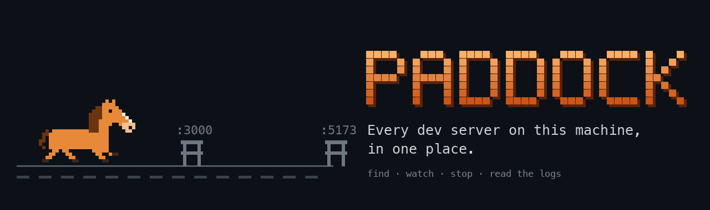
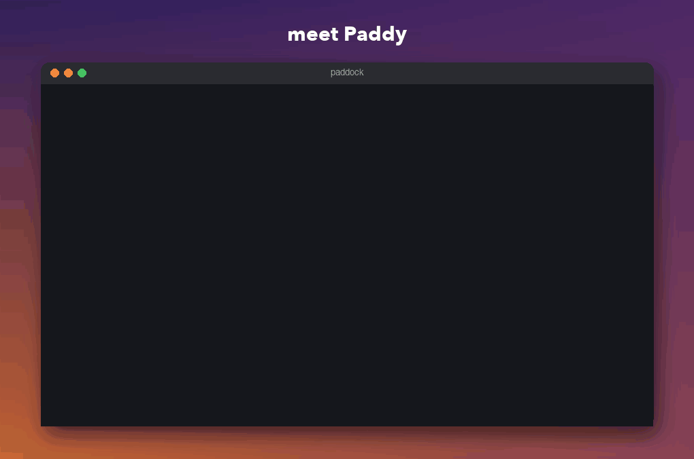
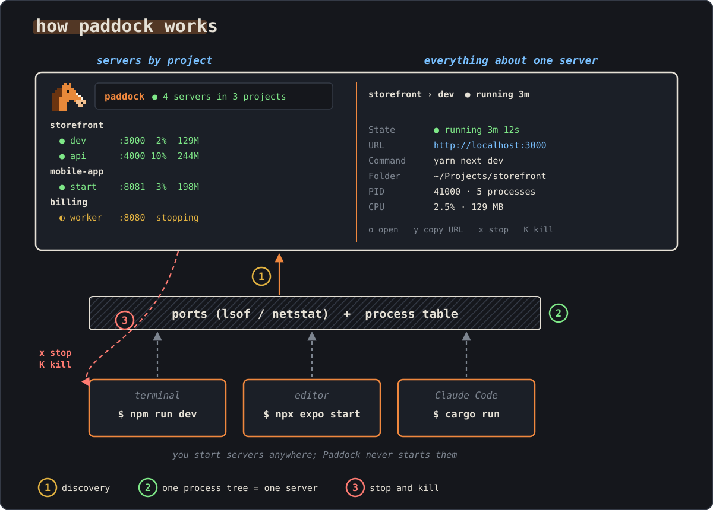

<p align="center">
  
</p>

<p align="center">
  <b>Every dev server on this machine, in one place.</b><br>
  Paddock is a terminal dashboard that finds the servers you start in any terminal, editor or agent,
  groups them by project, and stops them when you ask.
</p>

<p align="center">
  <a href="https://github.com/musaJawad004/paddock/releases/latest"></a>
  <a href="https://github.com/musaJawad004/paddock/actions/workflows/ci.yml"></a>
  <a href="https://github.com/musaJawad004/paddock/actions/workflows/supply-chain.yml"></a>
  <a href="LICENSE"></a>
</p>

<p align="center">
  
  <br>
  <sub>Recorded with <code>paddock --demo</code>. <a href="assets/demo.png">Still image</a>.</sub>
</p>

## Install

**macOS and Linux, with Homebrew**

```bash
brew tap musaJawad004/paddock https://github.com/musaJawad004/paddock
brew trust musaJawad004/paddock
brew install paddock
```

**macOS, Linux and Windows, with Cargo** (Rust 1.95 or newer)

```bash
cargo install --git https://github.com/musaJawad004/paddock --locked
```

Or download an archive for your platform (Windows included) from the
[latest release](https://github.com/musaJawad004/paddock/releases/latest).
An npm package (`npm install -g paddock-cli`) is coming soon.

## Quick start

```bash
paddock
```

Every dev server you have running shows up within two seconds, grouped by
project. Nothing to register, nothing to configure. Use `↑` `↓` to pick
one, `o` to open it in the browser, `x` to stop it.

```bash
paddock list       # the running servers, printed once
paddock --demo     # look around with made-up servers
paddock --help     # every command and flag
```

## How Paddock works

<p align="center">
  
</p>

1. **Discovery.** Every two seconds Paddock asks `lsof` (`netstat` on
   Windows) which programs listen on which ports, and the process table who
   started them. A listener counts when it is yours and runs below your home
   folder. Its project is the outermost folder around it with a project file
   (`package.json`, `Cargo.toml`, `go.mod`, `pyproject.toml` and more).
2. **One process tree is one server.** `yarn dev` and the `sh`, `vite` and
   `esbuild` processes below it are a single server named `dev`. Paddock
   walks up through dev runners only, so your shell, editor, terminal or a
   coding agent such as Claude Code is never part of a server.
3. **Stop and kill.** `x` sends SIGTERM to the whole tree and SIGKILL after
   five seconds; `K` kills at once. Each asks first, and Paddock checks the
   process is still the one you saw before it sends anything.

## Keys

| Key | Does |
|---|---|
| `↑` `↓` or `k` `j` | pick a server or a port |
| `tab` | switch between servers and ports |
| `enter` | jump from a port to its server |
| `o` | open in the browser |
| `y` / `Y` | copy its URL / its command |
| `x` / `K` | stop / kill the server |
| `,` | settings: theme, keys, splash |
| `?` / `q` | help / quit |

Every key can be changed in settings or in `~/.config/paddock/config.toml`:

```toml
[ui]
theme = "paddock"   # terminal, catppuccin-mocha, dracula, nord, gruvbox, tokyo-night, solarized-light
splash = true

[keys]
stop = "s"
quit = ["q", "ctrl+q"]
```

## Platforms

| | macOS | Linux | Windows |
|---|---|---|---|
| Find, group and stop servers | yes | yes (needs `lsof`) | yes |
| Stop with a grace period | SIGTERM, then SIGKILL | SIGTERM, then SIGKILL | ends the process at once |

## Architecture

```
src/
  main.rs            binary entry: error reporting, then cli
  cli.rs             paddock, list, --demo, --theme, --no-splash
  model.rs           Snapshot, Project, Server, ServerId, ListeningPort
  config.rs          ~/.config/paddock/config.toml (theme, keys, splash)
  project.rs         which folder is a project, from its files
  demo.rs            made-up servers for --demo
  monitor/           watches the machine; never starts anything
    mod.rs           scan loop every 2 s, stop deadlines
    ports.rs         lsof and netstat parsers
    stats.rs         process table: parents, folders, owners, CPU, memory
    servers.rs       listeners + process table -> projects and servers (pure)
    actions.rs       the only code that stops processes
  ipc/               Request and Event between the TUI and the monitor
  tui/               ratatui dashboard: app state, views, keys, themes, splash
```

The TUI and the monitor only talk through `ipc` messages. The grouping in
`monitor/servers.rs` is a pure function over a process table, so its rules
are unit tested with made-up tables. More detail, and the reasons behind each
choice, in [docs/ARCHITECTURE.md](docs/ARCHITECTURE.md).

## Development

```bash
git clone https://github.com/musaJawad004/paddock
cd paddock
git config core.hooksPath .githooks          # supply chain scan before each commit

cargo run                                    # the dashboard
cargo run -- --demo                          # made-up servers
cargo run -- list                            # one scan, printed
cargo test                                   # unit and real-process tests
cargo clippy --all-targets -- -D warnings
cargo fmt
cargo install --path . --locked              # put your build on PATH
```

Pull the latest and reinstall:

```bash
git pull && cargo install --path . --locked
```

Releases come from CI: bump the version in `Cargo.toml`, add a
`CHANGELOG.md` entry, then push a tag such as `v0.2.0`. The release workflow
builds every platform, publishes the GitHub release, updates the Homebrew
formula, and publishes to npm when the `NPM_TOKEN` secret is set.

## Privacy

Paddock reads the process table and runs `lsof` or `netstat`. It does not
change your shell, does not sit in front of any command, writes no files
except its settings, has no network code and sends no telemetry. The build fails if
network code is added: see `.github/workflows/supply-chain.yml`.

## License

MIT. See [LICENSE](LICENSE).
